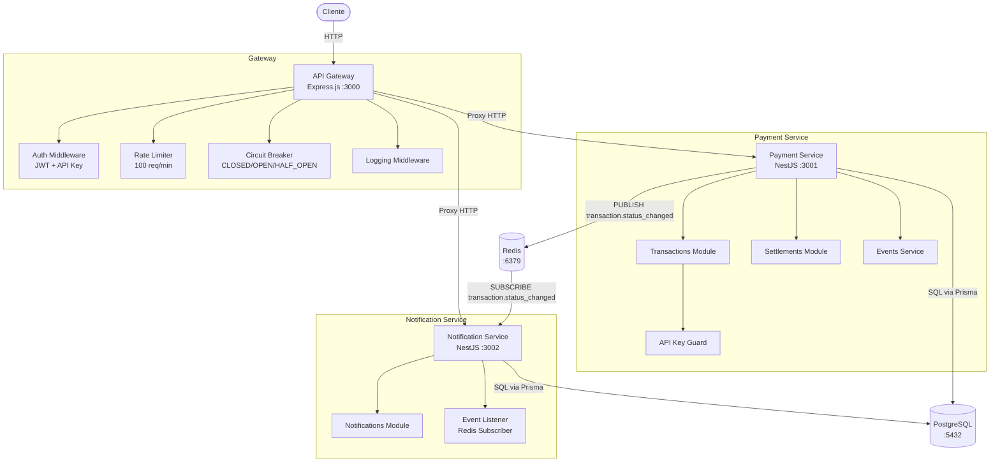

# Arquitectura del Sistema

## Diagrama de servicios



---

## Flujo de una transacción

```
Cliente
  │
  ▼
API Gateway (auth + rate limit + logging)
  │
  ▼ HTTP proxy
Payment Service
  ├── Valida API key (guard → busca merchant en DB)
  ├── Valida body (class-validator)
  ├── Genera referencia única TXN-YYYYMMDD-XXXXXX
  ├── Persiste en PostgreSQL
  └── Retorna 201

Cuando se hace PATCH /status:
Payment Service
  ├── Valida transición de estado (máquina de estados)
  ├── Actualiza en DB
  └── PUBLISH a Redis canal "transaction.status_changed"
           │
           ▼
  Notification Service (subscriber)
    ├── Parsea evento
    ├── Crea registro en tabla notifications (status: pending)
    └── Procesa con reintentos exponenciales (hasta 5 intentos)
        └── Actualiza status a "sent" o "failed"
```

---

## Flujo de generación de liquidación

```
POST /settlements/generate
  ├── Busca transacciones con status=approved del merchant en el rango de fechas
  │   que NO tengan settlement_transaction asociado
  ├── Si count == 0 → 404
  └── Transacción de DB:
      ├── Crea registro settlement (total_amount, transaction_count)
      └── Crea N registros settlement_transactions
          (transaction_id UNIQUE garantiza que una tx no se liquide dos veces)
```

---

## Circuit Breaker — Estados

```
         N fallos consecutivos
CLOSED ─────────────────────────► OPEN
  ▲                                 │
  │                                 │ timeout (30s)
  │                                 ▼
  └──────────────────────────── HALF_OPEN
        prueba exitosa               │
                                     │ falla
                                     ▼
                                   OPEN
```

- **CLOSED**: flujo normal, cuenta fallos.
- **OPEN**: rechaza todas las requests con `503` inmediatamente.
- **HALF_OPEN**: permite 1 request de prueba. Si pasa → CLOSED. Si falla → OPEN.

---

## Decisiones de diseño

### ¿Por qué Redis pub/sub para eventos?

Se evaluaron tres opciones:

| Opción | Pros | Contras |
|--------|------|---------|
| Redis pub/sub | Simple, sin overhead, sin dependencias extra en NestJS | No persiste mensajes; si el subscriber está caído, los pierde |
| BullMQ | Persistencia, reintentos automáticos, UI de monitoreo | Más complejidad de setup, dependencia adicional |
| NestJS Microservices TCP | Sin Redis adicional | Acoplamiento síncrono, no desacoplado de verdad |

Se eligió **Redis pub/sub** porque es suficiente para el alcance de la prueba y es la opción más liviana. El `notification-service` mitiga la pérdida de mensajes con reintentos exponenciales internos sobre el registro ya creado en DB.

En producción se reemplazaría por **BullMQ** para garantizar at-least-once delivery.

### ¿Por qué Decimal en lugar de Float para amounts?

`Float` tiene imprecisión de punto flotante que es inaceptable en valores monetarios. `Decimal(12,2)` en PostgreSQL garantiza precisión exacta. Prisma mapea esto al tipo `Decimal` de la librería `decimal.js`.

### ¿Por qué offset pagination en lugar de cursor?

Para el scope del sistema (volumen moderado de transacciones por merchant), offset pagination es suficiente y más simple de implementar y consumir. Cursor-based pagination es superior para datasets muy grandes o feeds en tiempo real, pero añade complejidad innecesaria aquí.

### ¿Por qué el API Gateway no tiene estado propio?

El rate limiter vive en memoria del proceso del gateway. En producción, con múltiples instancias del gateway, esto no funciona correctamente y debería externalizarse a Redis con una implementación sliding window. Para esta prueba la simplicidad está justificada.

### ¿Por qué `settlement_transactions.transaction_id` es UNIQUE?

Garantiza a nivel de base de datos que una transacción no puede pertenecer a más de una liquidación, independientemente de la lógica de la aplicación. Es una restricción de integridad referencial, no solo de negocio.

---

## Propuesta de escalabilidad — 10,000 TPS

Para escalar el sistema a 10,000 transacciones por segundo se requieren cambios en varias capas:

### Base de datos

- **Read replicas**: separar reads (listados, reportes) de writes (creación, cambios de estado).
- **Connection pooling**: introducir **PgBouncer** entre los servicios y PostgreSQL para limitar conexiones activas.
- **Particionamiento**: particionar la tabla `transactions` por rango de `created_at` (mensual). A 10K TPS, en un mes se generan ~26 billones de filas si no se archivan.
- **Archivado**: mover transacciones históricas a cold storage (S3 + Athena o Redshift) y mantener solo los últimos N días en la tabla activa.

### Servicios

- **Horizontal scaling**: múltiples réplicas de `payment-service` detrás de un load balancer (NGINX o un Ingress de Kubernetes).
- **Kubernetes**: deployments con HPA (Horizontal Pod Autoscaler) basado en CPU/RPS.
- **Separar el endpoint de reconocimiento de transacciones** del de cambio de estado — los patrones de carga son distintos.

### Comunicación asíncrona

- Reemplazar Redis pub/sub por **Kafka** o **RabbitMQ con quorum queues** para garantizar durabilidad y escalabilidad del stream de eventos.
- El `notification-service` se convierte en un consumer group de Kafka, permitiendo procesar eventos en paralelo con múltiples instancias sin duplicados.

### API Gateway

- Mover el rate limiting a **Redis** con el algoritmo de sliding window log para que funcione correctamente con múltiples instancias del gateway.
- Introducir un **CDN o WAF** delante del gateway para absorber tráfico malicioso antes de que llegue a la aplicación.

### Generación de referencias

- El mecanismo actual de reintentos en DB no escala a alta concurrencia (colisiones frecuentes). Reemplazar por un **generador de IDs distribuido** como Snowflake ID o ULID, que garantiza unicidad sin consultas a DB.

### Observabilidad

- Centralizar logs con **ELK Stack** o **Loki + Grafana**.
- Trazas distribuidas con **OpenTelemetry + Jaeger** para entender la latencia extremo a extremo.
- Métricas de negocio (TPS, tasa de rechazo, latencia p99) en **Grafana + Prometheus**.
